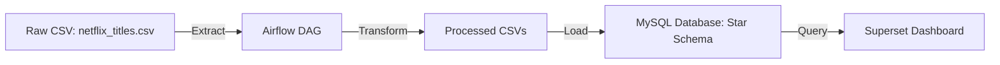
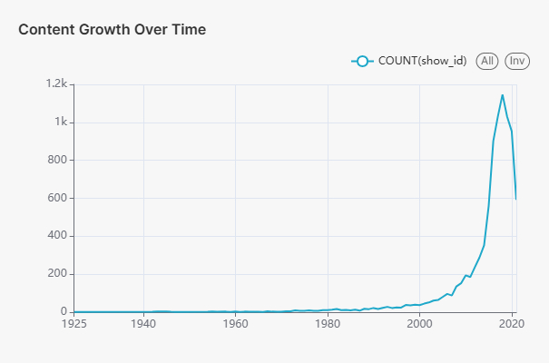
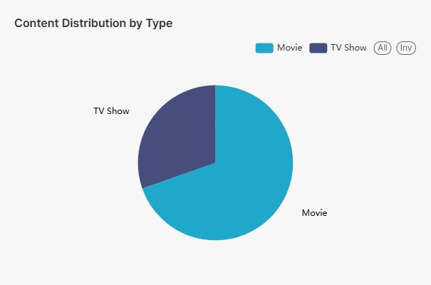
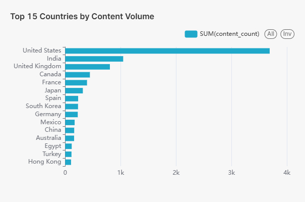
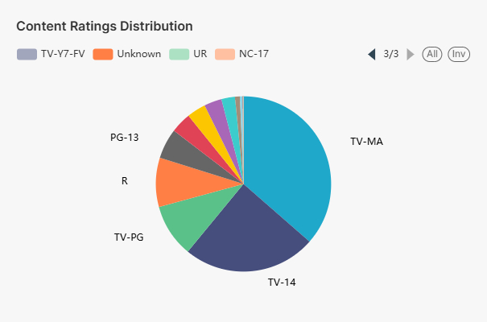
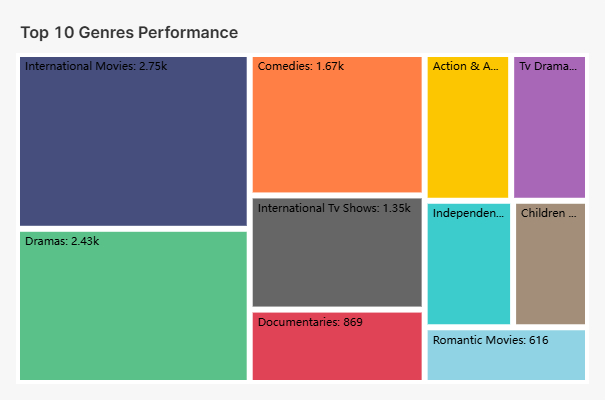
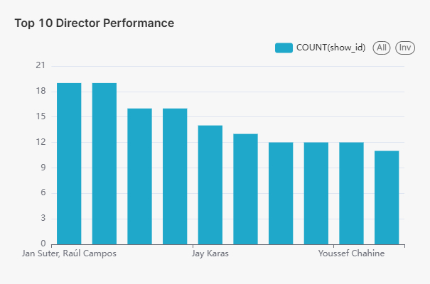
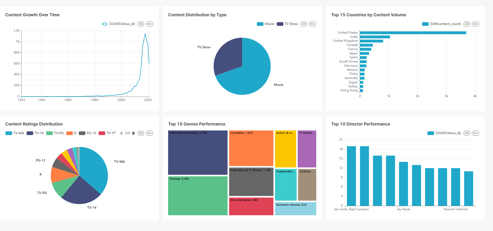

# Netflix ETL Pipeline with Airflow, MySQL, and Superset


## 📌 Introduction
This project implements an **ETL pipeline** to process the **Netflix Movies & TV Shows dataset**.  
The goal is to automate data extraction, transformation, loading into a **star schema** in MySQL, and visualize insights with Superset.  

Key technologies used:
- **Apache Airflow** – Workflow orchestration  
- **MySQL** – Data warehouse  
- **Docker Compose** – Containerized deployment  
- **Apache Superset** – Dashboard & visualization  

---

## ⚙️ System Architecture
- **Airflow** → Orchestrates and manages ETL tasks  
- **MySQL** → Stores processed data in a star schema  
- **Docker** → Ensures reproducible and isolated environments  
- **Superset** → Provides interactive dashboards  

### Pipeline Workflow
1. **Extract** → Load raw CSV (`netflix_titles.csv`) from `data/raw/`  
2. **Transform** → Clean & normalize into a star schema format  
3. **Load** → Insert transformed data into MySQL database  
4. **Visualize** → Explore insights with Superset dashboards  

---

## 🎯 Learning Objectives
This project was built to practice **Data Engineering skills**:
- Building ETL pipelines with Python & SQL  
- Workflow orchestration with Apache Airflow  
- Containerization with Docker Compose  
- Designing star schema data models in MySQL  
- Data visualization with Apache Superset  

---

## 📂 Project Structure
```
netflix-etl-pipeline/
├── docker-compose.yml          # Docker services (Airflow, MySQL, Superset, Redis, Flower)
├── .env                        # Environment variables
├── requirements.txt            # Python dependencies
├── Dockerfile.airflow          # Custom Airflow image
├── Dockerfile.superset         # Custom Superset image
├── airflow/
│   ├── dags/                   # ETL DAGs
│   │   ├── netflix_etl_dag.py
│   │   └── setup_connections.py
│   ├── logs/                   # Airflow logs
│   └── plugins/                # (optional custom operators/hooks)
├── configs/
│   ├── airflow.cfg
│   └── superset/superset_config.py
├── data/
│   ├── raw/
│   │   └── netflix_titles.csv  # Raw dataset
│   └── processed/              # Transformed CSVs for loading
└── dashboards/
    └── netflix_superset.json   # Exported Superset dashboard
```

---

## 📊 Raw Data Analysis (netflix_titles.csv)

### Dataset Structure & Quality Assessment

**Raw Dataset Characteristics:**
- **Source File**: `netflix_titles.csv` (12 columns, 8,800+ records)
- **Primary Key**: `show_id` (unique identifier for each title)
- **Content Types**: Movies and TV Shows
- **Date Range**: Content from 1925 to 2021

**Column Analysis:**
- `show_id`: Unique identifier (no nulls)
- `type`: Movie/TV Show classification 
- `title`: Content title (some duplicates across regions)
- `director`: Director information (significant missing values ~30%)
- `cast`: Cast information (missing values ~10%)
- `country`: Production country (missing values ~10%)
- `date_added`: Netflix addition date (missing values ~1%)
- `release_year`: Original release year (complete data)
- `rating`: Content rating (missing values ~5%)
- `duration`: Movie duration/TV seasons (complete data)
- `listed_in`: Genres/categories (comma-separated values)
- `description`: Content description (complete data)

**Data Quality Issues Identified:**
- **Missing Values**: Director, cast, country fields have substantial gaps
- **Inconsistent Formatting**: Country field contains multiple countries separated by commas
- **Genre Complexity**: `listed_in` field contains multiple genres per title
- **Date Format Variations**: `date_added` requires standardization
- **Duplicate Handling**: Same content may appear with different metadata

**Raw Data Patterns:**
- **Content Volume**: ~70% Movies, ~30% TV Shows
- **Missing Director Data**: Particularly common in older content and some international titles  
- **Multi-Country Productions**: Significant number of international collaborations
- **Genre Overlap**: Most content belongs to multiple genre categories
- **Temporal Distribution**: Heavy concentration of content added post-2015

**ETL Transformation Needs:**
- Normalize country data (split comma-separated values)
- Handle missing values with appropriate defaults
- Extract and normalize genre information
- Standardize date formats
- Create dimensional tables for star schema design
- Implement data quality checks and validation rules

This analysis informs our ETL pipeline design to properly clean, normalize, and structure the raw data for analytical queries.

---

## 🚀 How to Run

1. **Clone the repository**
   ```bash
   git clone https://github.com/<your-username>/netflix-etl-pipeline.git
   cd netflix-etl-pipeline
   ```

2. **Start all services**
   ```bash
   docker compose up -d --build
   ```
   This will start:  
   - Airflow (webserver, scheduler, worker, Redis, Flower, Postgres metadata DB)  
   - MySQL (data warehouse)  
   - Superset (visualization)  

3. **Initialize Airflow**
   ```bash
   docker exec -it airflow-webserver bash
   bash init_airflow.sh
   ```

4. **Initialize Superset**
   ```bash
   docker exec -it superset bash
   bash init_superset.sh
   ```

5. **Access the services**
   - Airflow → [http://localhost:8080](http://localhost:8080)  
   - Superset → [http://localhost:8088](http://localhost:8088)  
   - MySQL →  
     ```bash
     mysql -h localhost -P 3306 -u netflix_user -p
     ```

---

## ✅ Quick Test
1. Open Airflow UI → Trigger DAG `netflix_etl_dag`  
2. Check MySQL → Tables should be loaded into `netflix_db`  
3. Open Superset UI → Explore dashboard  

---

## 📊 Pipeline Diagram


---

## 📊 Dashboard Visualizations

### Content Growth Analysis
<div align="center">



*Shows exponential growth in Netflix content, with significant acceleration after 2015*

</div>

### Content Type Distribution
<div align="center">



*Movies comprise approximately 70% of Netflix catalog, with TV shows at 30%*

</div>

### Geographic Content Analysis
<div align="center">



*United States dominates content production, followed by India and United Kingdom*

</div>

### Content Rating Insights
<div align="center">



*TV-MA is the most common rating, indicating mature content preference*

</div>

### Genre Performance
<div align="center">



*International Movies and Dramas lead the platform, showing global content strategy*

</div>

### Director Analysis
<div align="center">



*Identifies most prolific directors on the platform*

</div>

### Complete Analytics Dashboard
<div align="center">



*Comprehensive view combining all key metrics and insights*

</div>

---

## 🔮 Future Improvements
- Support **incremental load** instead of full refresh  
- Add **data quality checks** with Great Expectations  
- Build a **recommendation engine**  
- Enable **Superset authentication** (OAuth/LDAP)  

---

## 📚 Dataset
- Source: [Netflix Movies & TV Shows](https://www.kaggle.com/shivamb/netflix-shows)  

---

## 👨‍💻 Author
- [meep2k3](https://github.com/meep2k3)

## 📜 License
This project is licensed under the MIT License - see the [LICENSE](LICENSE) file for details.
