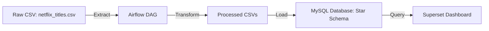

# Netflix ETL Pipeline with Airflow, MySQL, and Superset


## Overview
This project builds an **ETL pipeline** for the **Netflix Movies & TV Shows Dataset** using:
- **Airflow** for workflow orchestration
- **MySQL** as data warehouse
- **Superset** for dashboard & visualization

Pipeline steps:
1. **Extract**: Load raw CSV (`netflix_titles.csv`) from `data/raw`
2. **Transform**: Clean & normalize data into star schema
3. **Load**: Insert transformed data into MySQL
4. **Visualize**: Build interactive dashboards with Superset

---

## Learning Objectives
This project was developed to practice **Data Engineering skills**, including:
- Building ETL pipelines with Python & SQL
- Workflow orchestration using Apache Airflow
- Dockerized deployment with Docker Compose
- Designing a star schema data warehouse in MySQL
- Data visualization and dashboarding with Apache Superset

---

## Project Structure
```
netflix-etl-pipeline/
├── docker-compose.yml          # Docker services (Airflow, MySQL, Superset, Redis, Flower)
├── .env                        # Environment variables
├── requirements.txt            # Python dependencies
├── Dockerfile.airflow          # Custom Airflow image
├── Dockerfile.superset         # Custom Superset image
├── airflow/
│   ├── dags/                   # ETL DAGs
│   │   ├── netflix_etl_dag.py
│   │   └── setup_connections.py
│   ├── logs/                   # Airflow logs
│   └── plugins/                # (optional custom operators/hooks)
├── configs/
│   ├── airflow.cfg
│   └── superset/superset_config.py
├── data/
│   ├── raw/
│   │   └── netflix_titles.csv  # Raw dataset
│   └── processed/              # Transformed CSVs for loading
└── dashboards/
    └── netflix_superset.json   # Exported Superset dashboard
```

---

## How to Run

1. Clone the repository
   ```bash
   git clone https://github.com/<your-username>/netflix-etl-pipeline.git
   cd netflix-etl-pipeline
   ```

2. Start all services with Docker
   ```bash
   docker compose up -d --build
   ```
   This will start:
   - Airflow (webserver, scheduler, worker, Flower, Redis, Postgres metadata DB)  
   - MySQL (data warehouse for Netflix schema)  
   - Superset (dashboard & visualization)  

3. Initialize Airflow
   ```bash
   docker exec -it airflow-webserver bash
   bash init_airflow.sh
   ```

4. Initialize Superset
   ```bash
   docker exec -it superset bash
   bash init_superset.sh
   ```

5. Access the UIs
   - Airflow: [http://localhost:8080](http://localhost:8080)  
   - Superset: [http://localhost:8088](http://localhost:8088)  
   - MySQL:  
     ```bash
     mysql -h localhost -P 3306 -u netflix_user -p
     ```

---

## Quick Test

- Go to Airflow UI (`http://localhost:8080`)  
- Trigger the DAG `netflix_etl_dag`  
- Check MySQL database `netflix_db` to see loaded tables  
- Explore the Superset dashboard at (`http://localhost:8088`)  

---

## Dashboard Features
- Content growth over time  
- Movie and TV show distribution  
- Top genre and countries  
- Rating distribution  
- Content duration and season analysis  

---

## Pipeline Diagram


---

## Future Improvements
- Add incremental load instead of full refresh  
- Integrate data quality checks with Great Expectations  
- Add recommendation engine for movies  
- Deploy Superset with authentication (OAuth/LDAP)  

---

## Dataset
Source: [Netflix Movies & TV Shows Dataset](https://www.kaggle.com/shivamb/netflix-shows)
